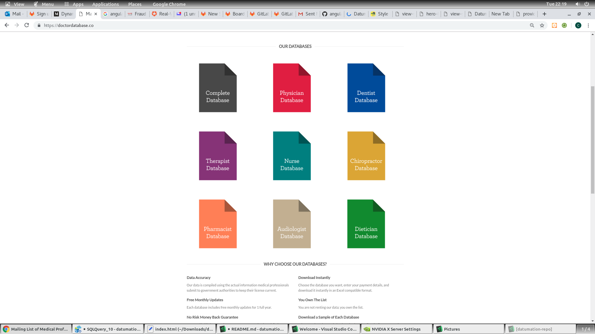
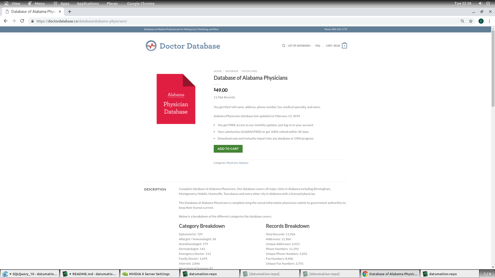
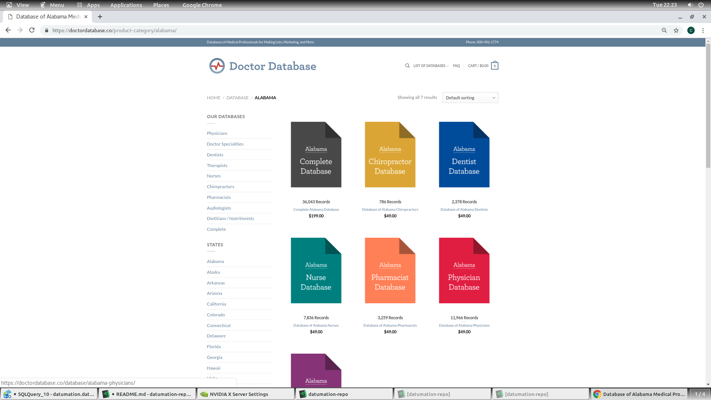
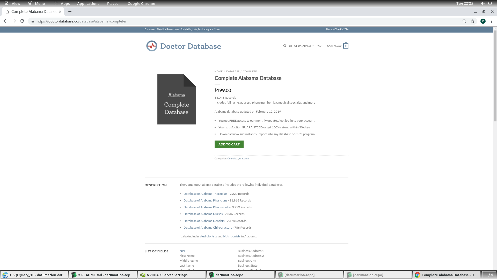

## Project app_datumation
---
1. Client App
   1. Angular 7 
   2. Auth0 Authentication
   3. Stripe/Paypal Payment

2. Server App
   1. aspnet core c#
      1. v 2.2
      2. Memory Cache
      3. Dapper Async
      4. Fully Async
   

---
TODO:
- [ ] Clean the client app for providers

---
- [ ] Home page for all specialty types
---

---
- [ ] States Specialties
---

---
- [ ] Combo Details
---

---
- [ ] Sidebar
---
- [ ] Click State and get States List
---

---
- [ ] State Detail Complete
